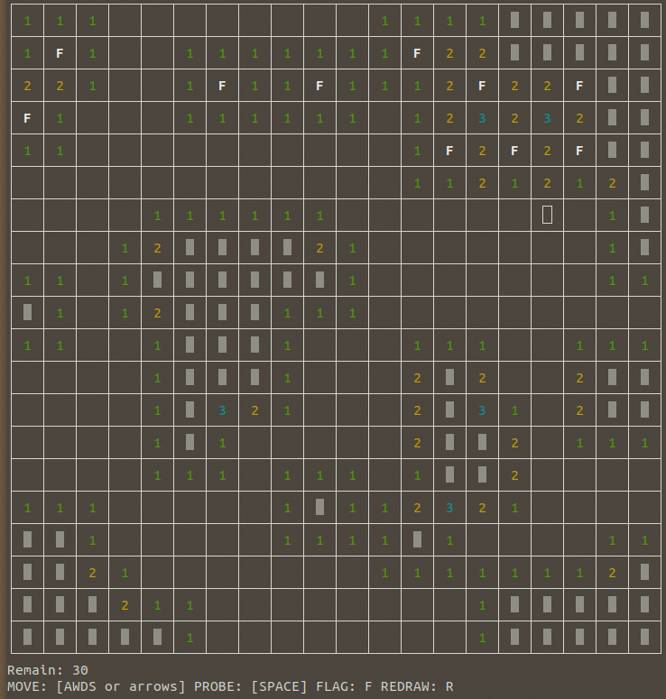

# terminal_minesweeper
<h3>A terminal minesweeper implemented with curses</h3>

Practice of linux programming.

<h3>How to run:</h3>

  Download the file and make sure your system has curses/ncurses. 
  Run: <b>gcc -o mine mine.c -lncurses</b> 
  Followed by: <b>./mine [custom row#] [custom col#] [custom mine#]</b>

<h3>Screenshot</h3>

  </img>

